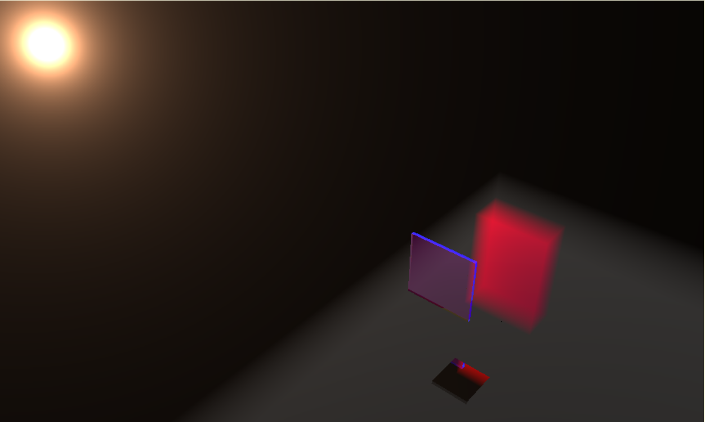

# Boxel_Engine

## What is it ?

An engine on browser that uses simplified raytracing running on GPU. This engine doesn't use triangles as models but boxels.



## How to use it ?

just download GPU.js module because Boxel engine is using GPU.js and  download the boxel_engine.js file and wright this lines in your html file.

```html
    <script src="js/gpu-browser.min.js"></script>
    <script src="js/boxel_engine.js"></script>
```

You can then create a BoxelEngine instance and add a camera and boxels with material and lights :

```javascript

  let light = new Light(200, // Power
                        [1., 1., 1.], // "Color" -> values can be negatives, it will then spread shadow !
                        [30,30,30]); // Position

  let material = new Material([1,1,1], // Diffusion, i.e color
                              [0.999,0.9993,0.9995], // Transparency percentage
                              [0, 0, 0], // Reflection percentage
                              [1, 1, 1]); // Refraction indice
  
  let boxel = new Boxel([0,0,0], // position
                        [100,100,100], // sizes
                        material, // material
                        null, //parent boxel
                        [], // inner boxels
                        [light]); // inner lights

  let width = 1000;
  let height = 600;
  let camera = new Camera(width, height, document.body);
  
  let boxel_engine = new BoxelEngine(camera, boxel);
  
  //draw frame
  boxel_engine.render();
```

See our first example to have more details on how you can move, set camera position and orientation etc...

## How does that works ?

Soon

